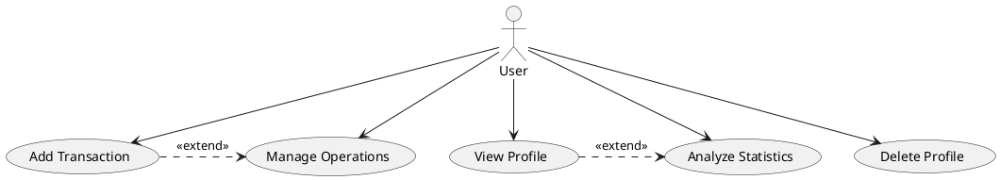
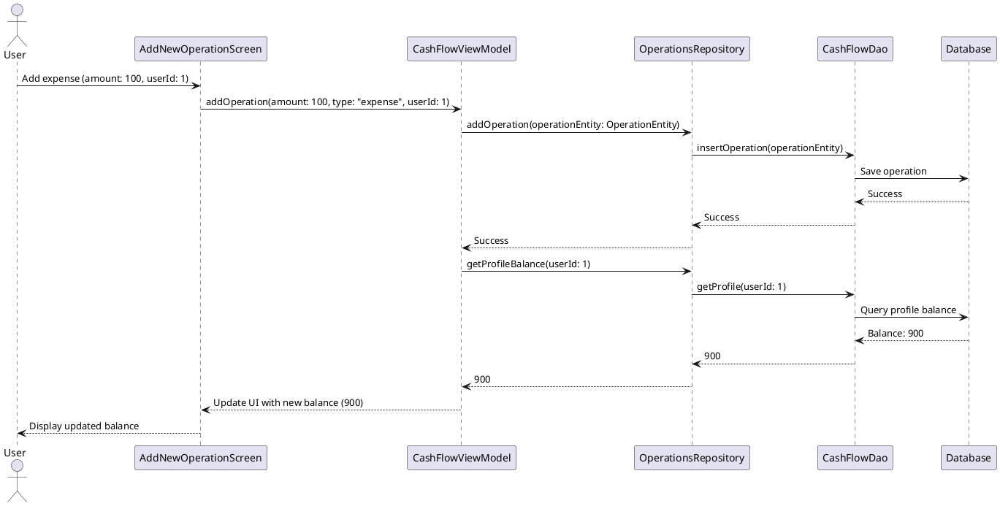
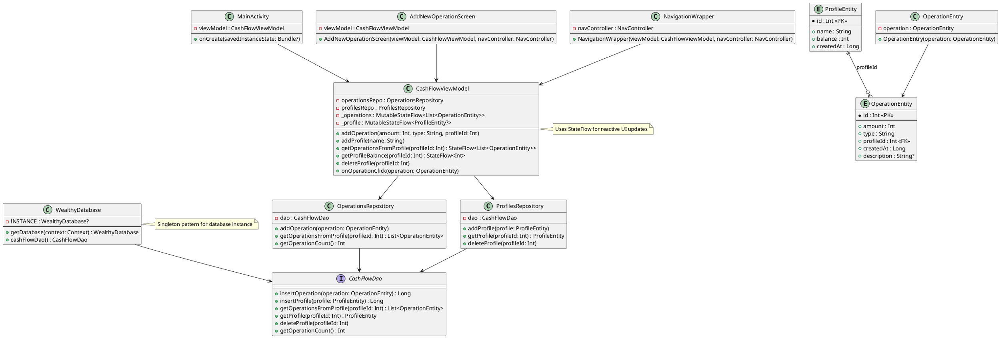

# Опис
**Wealthy** – це мобільний застосунок для управління особистими фінансами. Він дозволяє користувачам:

- Відстежувати доходи та витрати.
- Аналізувати фінансову статистику за категоріями.
- Планувати бюджет та накопичення.
- Зберігати дані про різні баланси (готівка, картки, депозити тощо).
- Отримувати візуалізацію фінансових потоків у вигляді графіків та діаграм.

Застосунок розроблений з використанням **Kotlin**, **Jetpack Compose**, **MVVM + Clean Architecture**, що забезпечує модульність і підтримуваність коду.
# Mockup застосунку
## Головний екран


## Екран додавання нової транзакції


## Екран статистики


# Завдання

## 1. Модель якості
- Визначити основні атрибути якості мобільного застосунку.
- Розробити модель якості, враховуючи енергоефективність та
швидкодію.
## 2. Базові метрики якості:
- Використати Android Lint, SonarQube для перевірки якості коду.
- Аналіз метрик продуктивності (використання CPU, пам’яті,
швидкодія UI).
## 3. Формальна верифікація специфікацій:
Розробити Alloy-модель для бізнес-логіки (наприклад, "баланс
користувача не може бути від’ємним" або "дебетова транзакція не
може бути виконана, якщо на балансі не вистачає коштів").
## 4. Верифікація моделей архітектури:
Створити UML-діаграми для логіки додатка у PlantUML та перевірити
їхню консистентність.
## 5. Git Flow та GitHub Actions:
- Організувати Git Flow для проєкту.
- Налаштувати GitHub Actions для автоматизації тестів.
- Налаштувати CI/CD для автоматичної збірки та модульного
тестування.
- Додати інструменти статичного аналізу та код-рев’ю.

# Хід роботи
## 1. Модель якості

### Основні атрибути якості Wealthy
- **Продуктивність (Performance)** – швидкість відображення UI, використання CPU/RAM.
- **Енергоефективність (Energy Efficiency)** – мінімальне використання батареї під час роботи.
- **Надійність (Reliability)** – стабільність додатку, відсутність критичних помилок.
- **Юзабіліті (Usability)** – зручність інтерфейсу для користувачів.
- **Безпека (Security)** – захист фінансових даних від витоків.
- **Модульність (Maintainability)** – легкість у підтримці та розширенні.

### Модель якості мобільного застосунку Wealthy

#### 1. Функціональна придатність (Functional Suitability)

##### 1.1. Коректність (Correctness)
- Всі фінансові операції обробляються без помилок.
- Баланс профілю ніколи не стає від’ємним без дозволу користувача.
- Витрати та доходи правильно категоризуються.
##### 1.2. Повнота (Completeness)
- Додаток підтримує всі основні операції: введення доходів, витрат, аналіз статистики.
- Доступні звіти та графіки за періодами.
##### 1.3. Узгодженість (Consistency)
- Інтерфейс дотримується єдиних стандартів UI/UX.
- Формати введення та виводу даних є передбачуваними.
#### 2. Продуктивність та ефективність (Performance Efficiency)
##### 2.1. Швидкодія (Response Time)
- Відкриття основних екранів займає <500 мс.
- Анімації плавні, без затримок (>60 FPS).
##### 2.2. Використання ресурсів (Resource Utilization)
- Додаток не перевантажує CPU (>10% завантаження в фоні неприпустиме).
- Споживання пам’яті не перевищує 100 МБ в стандартному режимі.
##### 2.3. Енергоефективність (Energy Efficiency)
- Оптимізація роботи з батареєю (мінімальні wake-lock’и).
- Відсутність постійного використання GPS у фоновому режимі.
#### 3. Сумісність (Compatibility)
##### 3.1. Кросплатформеність (Cross-platform Compatibility)
- Підтримка Android версій **7.0+** (API 24+).
- Коректна робота на різних екранах (small, normal, large, xlarge).
##### 3.2. Інтеграція (Interoperability)
- Синхронізація з хмарними сервісами (Google Drive, Firebase).
- Можливість експорту транзакцій у CSV/Excel.
#### 4. Юзабіліті (Usability)

##### 4.1. Зручність інтерфейсу (UI Design)
- Мінімальна кількість кліків для додавання транзакції (<3 кроків).
- Інтуїтивне розташування елементів UI.
##### 4.2. Доступність (Accessibility)
- Контрастність кольорів відповідає WCAG AA.
- Підтримка темної/світлої теми.
#### 5. Надійність (Reliability)
##### 5.1. Відмовостійкість (Fault Tolerance)
- Автоматичне збереження введених даних перед виходом.
- Перевірка вхідних даних перед збереженням.
##### 5.2. Відновлення після збою (Recoverability)
- Автоматичне відновлення даних після краху програми.
- Можливість резервного копіювання та відновлення.
#### 6. Безпека (Security)
##### 6.1. Захист даних (Data Protection)
- Локальне шифрування збережених даних.
- Мінімізація запитів до мережі для конфіденційних операцій.
##### 6.2. Контроль доступу (Access Control)
- Вхід за допомогою PIN-коду або біометрії.
- Обмеження доступу до конфіденційних даних у фоновому режимі.
#### 7. Супроводжуваність (Maintainability)
##### 7.1. Модульність (Modularity)
- Архітектура MVVM + Clean Architecture.
- Мінімальна зв’язаність модулів (low coupling).
##### 7.2. Аналіз коду (Code Analyzability)
- Регулярне використання Android Lint, SonarQube.
- Стандарти код-рев’ю через GitHub Pull Requests.
## 2. Базові метрики якості
### Android Lint
#### 1. Перевірка якості коду за допомогою Android Lint


Android Lint було запущено для аналізу коду проєкту Wealthy. Отримані результати включали наступні категорії попереджень:
##### Performance (Продуктивність):
- Використання `mutableStateOf` для `Float`, що призводить до автоупаковки значень. **Рішення:** заміна на `mutableFloatStateOf`.  
- Використання Kapt замість KSP. **Рішення:** перехід на KSP для генерації коду.
##### Correctness (Правильність роботи):
- Зайвий `label` у `AndroidManifest.xml`. **Рішення:** видалення непотрібного атрибута.     
- `targetSdkVersion` не є останньою версією. **Рішення:** оновлення до актуального значення.     
##### Productivity (Продуктивність розробки):
Використання традиційного управління залежностями у `build.gradle`. **Рішення:** перехід на [Version Catalogs](https://developer.android.com/studio/build/dependencies-version-catalogs) для зручнішого управління залежностями.
##### Declaration Redundancy (Невикористані оголошення):
- Велика кількість невикористаних методів у Java (`AddOperation`, `DeleteProfile`, `GetProfile` тощо). **Рішення:** видалення або позначення `@Suppress("Unused")`.
- Невикористані `import` у Kotlin. **Рішення:** очищення від зайвих `import`.
---
#### 2. Аналіз метрик продуктивності
Оцінка продуктивності включала аналіз:
##### Використання CPU та пам’яті:
- Моніторинг виконання через `Android Profiler` не виявив критичних витоків пам’яті.     
- Виявлено надмірне використання `LiveData`, що може бути оптимізовано за допомогою `StateFlow`.     
##### Швидкодія UI:
Виявлені затримки в обробці великих списків у `LazyColumn`. **Рішення:** використання `rememberLazyListState` для оптимізації прокручування.
#### 3. Висновки та рекомендації
Аналіз Android Lint виявив 46 попереджень, які стосуються продуктивності, правильності, стилю коду та продуктивності розробки. Основні проблеми:
- Застарілий targetSdkVersion, що обмежує сумісність із сучасними пристроями.
- Невикористані ресурси (7), які збільшують розмір APK.
- Зайві конструкції та декларації (33 попередження), що ускладнюють код.
- Використання застарілого Kapt замість KSP, що уповільнює компіляцію.
**План дій:**
1. Оновити targetSdkVersion до 34.
2. Видалити невикористані ресурси за допомогою інструменту Android Studio.
3. Перейти з Kapt на KSP для швидшої компіляції.
4. Провести рефакторинг коду, усунувши зайві декларації та конструкції.
5. Перейти на TOML version catalog для управління залежностями.
---
### Аналіз якості коду за допомогою SonarQube


#### 1. Загальний огляд результатів
SonarQube — це інструмент статичного аналізу коду, який використовується для оцінки якості програмного забезпечення за кількома критеріями, такими як безпека, надійність, легкість підтримки (maintainability), покриття тестами та дублювання коду. Для аналізу якості мобільного застосунку для відстеження витрат було виконано перевірку коду за допомогою SonarQube (версія SonarQube Cloud).
**Основні метрики з Main Branch Summary:**
- **Загальний обсяг коду**: 1.6K рядків коду (Lines of Code).
- **Якість (Quality Gate)**: Не обчислено (Sonar Way).
- **Безпека (Security)**: 0 відкритих проблем, 1 security hotspot.
- **Надійність (Reliability)**: 0 відкритих проблем (оцінка A).
- **Легкість підтримки (Maintainability)**: 16 відкритих проблем (оцінка A), 19 хвилин зусиль для виправлення.
- **Покриття тестами (Coverage)**: Не налаштовано.
- **Дублювання коду (Duplications)**: 0.0% (немає дубльованого коду на 1.9K рядків).
- **Останній аналіз**: 24 хвилини тому, ідентифікатор bc8057d4.
**Деталі проблем (Issues):**
- Загалом виявлено **16 проблем**, усі належать до категорії **Maintainability**.
- Розподіл за рівнем серйозності:
    - **Major**: 2 проблеми.
    - **Minor**: 13 проблем.
    - **Info**: 1 проблема.
- Усі проблеми класифіковані як **Code Smell** (проблеми стилю коду, які можуть ускладнити підтримку).
---
#### 2. Детальний аналіз проблем
##### 2.1. Основні категорії проблем
Усі 16 проблем належать до категорії **Maintainability** і класифіковані як **Code Smell**. Це означає, що вони не впливають на функціональність застосунку, але можуть ускладнити його підтримку, читабельність і розширюваність у майбутньому. Усі проблеми мають тег **Intentionality**, що вказує на те, що вони пов’язані з певними стилістичними або структурними недоліками, які потребують уваги.
**Розподіл за серйозністю:**
- **Major (2 проблеми)**: Потребують першочергового виправлення, оскільки можуть значно впливати на читабельність або структуру коду.
- **Minor (13 проблем)**: Менш критичні, але все ще потребують уваги для покращення якості.
- **Info (1 проблема)**: Інформаційна проблема, яка більше слугує як рекомендація.
##### 2.2. Приклади проблем
SonarQube надав список із 16 проблем, ось аналіз кількох із них:
1. **Проблема 1: "Complete the task associated to this TODO comment"**
    - **Файл**: AddNewOperationScreen.kt.
    - **Тип**: Code Smell.
    - **Серйозність**: Major.
    - **Зусилля для виправлення**: 0 хвилин.
    - **Пояснення**: У коді є коментар TODO, який вказує на незавершену задачу. Залишення таких коментарів без виконання може призводити до технічних боргів.
    - **Вплив**: Наявність незавершених задач ускладнює розуміння коду та може свідчити про недоліки в логіці.
    - **Рішення**: Переглянути коментар TODO, завершити відповідну задачу або видалити коментар, якщо задача більше не актуальна.
2. **Проблема 2: "Use '' instead of the unused lambda parameter 'index'"**
    - **Файл**: AddNewOperationScreen.kt.
    - **Тип**: Code Smell.
    - **Серйозність**: Major.
    - **Зусилля для виправлення**: 5 хвилин.
    - **Пояснення**: У коді є лямбда-вираз, де параметр index не використовується. У Kotlin у таких випадках рекомендується замінити невикористаний параметр на _, щоб покращити читабельність.
    - **Вплив**: Невикористані параметри ускладнюють читабельність і можуть вводити в оману.
    - **Рішення**: Замінити index на _. Наприклад:

        `items.forEachIndexed { index, item -> ... } // До items.forEachIndexed { _, item -> ... } // Після`
        
3. **Проблема 3: "Remove this unused import"**
    - **Файл**: CashFlowDao.kt, OperationEntity.kt.
    - **Тип**: Code Smell.
    - **Серйозність**: Minor.
    - **Зусилля для виправлення**: 1 хвилина.
    - **Пояснення**: У файлах є невикористані імпорти, які не потрібні для роботи коду.
    - **Вплив**: Зайві імпорти збільшують розмір файлу та можуть заплутувати розробників.
    - **Рішення**: Використати функцію Android Studio **Code > Optimize Imports**, щоб автоматично видалити невикористані імпорти.
##### 2.3. Security Hotspot
- **Кількість**: 1 security hotspot.
- **Пояснення**: Security Hotspot вказує на потенційно вразливе місце в коді, яке потребує перевірки.
- **Вплив**: Потенційна вразливість може призвести до проблем із безпекою.
- **Рішення**: Переглянути деталі Security Hotspot у SonarQube, перевірити код на відповідність кращим практикам безпеки (наприклад, валідація введення, уникнення жорстко закодованих секретів).
##### 2.4. Покриття тестами
- **Статус**: Не налаштовано.
- **Пояснення**: SonarQube не виявив даних про покриття тестами, оскільки аналіз покриття не був налаштований.
- **Вплив**: Без покриття тестами важко оцінити, наскільки код протестований, що може призводити до непомічених помилок.
- **Рішення**: Налаштувати аналіз покриття тестами в SonarQube.
##### 2.5. Дублювання коду
- **Рівень дублювання**: 0.0% на 1.9K рядків.
- **Пояснення**: У коді немає дубльованих фрагментів, що є позитивним показником.
- **Вплив**: Відсутність дублювання спрощує підтримку та зменшує ризик помилок.
- **Рішення**: Продовжувати уникати дублювання коду в майбутніх змінах.
---
#### 3. Оцінка якості (Maintainability)
- **Рейтинг**: A (найвищий).
- **Кількість проблем**: 16.
- **Зусилля для виправлення**: 19 хвилин.
- **Пояснення**: Незважаючи на 16 проблем, загальний рейтинг Maintainability залишається високим (A), оскільки проблеми мають переважно низький або середній рівень серйозності. Зусилля для їх виправлення є мінімальними (19 хвилин).
- **Рекомендація**: Виправити Major-проблеми в першу чергу, потім перейти до Minor та Info.
---
#### 4. Висновки та рекомендації
Аналіз SonarQube виявив 16 проблем у категорії Maintainability, усі з яких класифіковані як Code Smell. Основні проблеми:
- Наявність незавершених задач (TODO), які потрібно виконати або видалити.
- Невикористані параметри в лямбда-виразах, які ускладнюють читабельність.
- Невикористані імпорти, які захаращують код.
- Відсутність налаштування покриття тестами, що обмежує оцінку якості коду.
- Один Security Hotspot, який потребує перевірки.
**План дій:**
1. **Виправлення Major-проблем**:
    - Завершити або видалити TODO в AddNewOperationScreen.kt.
    - Замінити невикористані параметри лямбда-виразу на _
2. **Виправлення Minor-проблем**:
    - Видалити невикористані імпорти у всіх файлах (AddNewOperationScreen.kt, CashFlowDao.kt, OperationEntity.kt).
3. **Перевірка Security Hotspot**:
    - Переглянути деталі в SonarQube і вжити заходів (наприклад, перевірити валідацію введення).
4. **Налаштування покриття тестами**:
    - Додати модульні тести та налаштувати JaCoCo для генерації звітів покриття.
    - Повторно запустити аналіз SonarQube для оцінки покриття.
5. **Підтримка якості**:
    - Продовжувати уникати дублювання коду.
    - Регулярно запускати SonarQube для моніторингу нових проблем.

## 3. Формальна верифікація специфікацій
### 1. Опис завдання
Для забезпечення коректності бізнес-логіки мобільного застосунку для відстеження витрат було виконано формальну верифікацію специфікацій за допомогою інструменту Alloy. Метою було перевірити два ключові правила:
1. Баланс користувача не може бути від’ємним.
2. Дебетова транзакція (витрата) не може бути виконана, якщо на балансі недостатньо коштів.
### 2. Alloy-модель
Для моделювання системи створено Alloy-модель, яка включає:
- Користувачів (User) з балансом (balance) і множиною транзакцій (transactions).
- Транзакції (Transaction), які поділяються на доходи (Income) і витрати (Expense).
**Повний код моделі:**
```alloy
sig User {
  balance: Int,
  transactions: set Transaction
}

abstract sig Transaction {
  amount: Int,
  owner: one User
}

sig Income extends Transaction {}
sig Expense extends Transaction {}

fact {
  all u: User | u.balance >= 0

  all u: User | u.balance = (sum i: Income | i.owner = u => i.amount else 0) - 
                            (sum e: Expense | e.owner = u => e.amount else 0)

  all e: Expense | let u = e.owner | 
    u.balance - e.amount >= 0

  all t: Transaction | t.amount > 0

  all t: Transaction | one u: User | t in u.transactions

  // Додаткове обмеження для гарантії, що сума доходів >= сумі витрат
  all u: User | 
    (sum i: Income | i.owner = u => i.amount else 0) >= 
    (sum e: Expense | e.owner = u => e.amount else 0)
}

assert NoOverdraft {
  all e: Expense | let u = e.owner | 
    (sum i: Income | i.owner = u => i.amount else 0) >= 
    (sum ex: Expense | ex.owner = u => ex.amount else 0)
}

check NoOverdraft for 5
run {} for 3 User, 5 Transaction
```
**Пояснення моделі:**
Сигнатура User описує користувача з балансом (balance) і множиною транзакцій (transactions).
Сигнатура Transaction є абстрактною і має два підтипи: Income (дохід) і Expense (витрата). Кожна транзакція має суму (amount) і зв’язок із користувачем (owner).
Обмеження (fact):
    - Баланс користувача завжди невід’ємний: all u: User | u.balance >= 0.
    - Баланс обчислюється як сума доходів мінус сума витрат.
    - Перед виконанням витрати перевіряється, що баланс достатній: all e: Expense | u.balance - e.amount >= 0.
    - Сума транзакції завжди додатна: all t: Transaction | t.amount > 0.
    - Кожна транзакція належить лише одному користувачу.
    - Додаткове обмеження гарантує, що сума доходів завжди більша або дорівнює сумі витрат, що унеможливлює овердрафт.
### 3. Результати верифікації

Модель була запущена в Alloy Analyzer із параметрами check NoOverdraft for 5 (перевірка правила "неможливість овердрафту" для до 5 об’єктів) і run {} for 3 User, 5 Transaction (генерація прикладу для до 3 користувачів і 5 транзакцій). Результати наведено нижче:
#### 3.1. Перевірка assert NoOverdraft
- **Результат**: Контрприкладів не знайдено.
- **Деталі**: Перевірка правила "неможливість овердрафту" підтвердила, що сума доходів завжди більша або дорівнює сумі витрат для всіх можливих сценаріїв із до 5 об’єктів. Це узгоджується з обмеженням, яке гарантує, що баланс користувача не може бути від’ємним.
- **Висновок**: Правило "дебетова транзакція не може бути виконана, якщо на балансі недостатньо коштів" виконується коректно.
#### 3.2. Генерація прикладу
- **Результат**: Знайдено узгоджений приклад.
- **Деталі**: Виконання команди run {} for 3 User, 5 Transaction показало, що модель здатна генерувати валідні сценарії, які відповідають усім обмеженням. Приклад із до 3 користувачів і 5 транзакцій узгоджений і демонструє коректну роботу моделі.
- **Висновок**: Модель є консистентною і здатна описувати реальні сценарії роботи застосунку.
#### 3.3. Аналіз правил
- **Правило 1: Баланс користувача не може бути від’ємним**:
    - Забезпечується обмеженням all u: User | u.balance >= 0. Перевірка NoOverdraft додатково підтвердила, що це правило виконується в усіх сценаріях.
- **Правило 2: Дебетова транзакція не може бути виконана, якщо на балансі недостатньо коштів**:
    - Забезпечується двома обмеженнями: all e: Expense | u.balance - e.amount >= 0 і додатковим правилом, яке гарантує, що сума доходів >= сумі витрат. Перевірка NoOverdraft підтвердила коректність цього правила.
### 4. Висновки
Alloy-модель успішно верифікувала бізнес-логіку застосунку. Обидва правила (невід’ємність балансу та обмеження на дебетові транзакції) виконуються:
- Баланс користувача завжди залишається невід’ємним завдяки обмеженню u.balance >= 0 і правилу, що сума доходів >= сумі витрат.
- Дебетові транзакції (витрати) не виконуються, якщо на балансі недостатньо коштів, що підтверджено перевіркою assert NoOverdraft.
Модель є консистентною, про що свідчить успішна генерація прикладів для 3 користувачів і 5 транзакцій. Вона може бути розширена для перевірки додаткових правил, наприклад, максимального ліміту транзакцій або коректності категорій витрат.
## 4. Верифікація моделей архітектури

### 1. Опис завдання
Для опису логіки мобільного застосунку для відстеження витрат створено UML-діаграми за допомогою PlantUML на основі аналізу коду репозиторію. Створені діаграми включають:
- Use Case Diagram для опису взаємодії користувача з системою.
- Sequence Diagram для демонстрації процесу додавання транзакції.
- Class Diagram для опису структури системи.
Після створення діаграм перевірено їхню консистентність між собою та з бізнес-логікою.

---
### 2. Use Case Diagram
Use Case Diagram показує основні дії користувача в додатку.


**Опис:** Користувач може додавати транзакції, переглядати профілі, аналізувати статистику, видаляти профілі та управляти операціями.

---
### 3. Sequence Diagram
Sequence Diagram описує сценарій додавання нової витрати.


**Опис:** Сценарій показує, як користувач додає витрату через AddNewOperationScreen, яка зберігається в базі даних через CashFlowViewModel, OperationsRepository і CashFlowDao, після чого оновлюється баланс.

---
### 4. Class Diagram


**Опис:** Class Diagram включає деталізовані атрибути та методи, виявлені в коді, а також додаткові класи, такі як MainActivity, NavigationWrapper, OperationEntry та конфігурації Room (WealthyDatabase). Вона відображає архітектуру MVVM із деталями реалізації бази даних, UI-компонентів і логіки.
### 5. Перевірка консистентності
- **Use Case Diagram**: Відображає дії користувача, які узгоджені з функціоналом у коді (наприклад, AddNewOperationScreen, MainActivity).
- **Sequence Diagram**: Узгоджена з Class Diagram, використовуючи методи, визначені в класах (addOperation, getProfile).
- **Class Diagram**: Відображає реальну структуру проєкту, включаючи деталі атрибутів і методів із коду.
- **Відповідність бізнес-логіці**: Діаграми відповідають бізнес-правилам (невід’ємність балансу, обмеження на витрати), верифікованим через Alloy.
### 6. Висновки
UML-діаграми успішно описують архітектуру та логіку додатка:
- Use Case Diagram показує взаємодію користувача з системою.
- Sequence Diagram демонструє процес додавання транзакції.
- Class Diagram відображає детальну структуру системи.
---
## 5. Git Flow та GitHub Actions
### 1. Організація Git Flow
#### 1.1. Мета та підхід
Метою впровадження Git Flow у проєкт Wealthy було створення структурованої системи розгалуження для управління розробкою мобільного додатка для відстеження витрат. Git Flow забезпечує чіткий розподіл між основними гілками, що дозволяє паралельно працювати над новими функціями, виправленнями помилок та підготовкою релізів. Для реалізації було використано Git Flow AVH Edition, сумісний із Windows-системою, інтегрований у встановлену версію Git.
#### 1.2. Встановлення Git Flow
Git Flow було встановлено на Windows через вбудовану підтримку в Git для Windows. Перевірка наявності Git Flow виконана командою:
```bash
git flow version
```
Оскільки версія відобразилася (1.12.3), ручна установка не знадобилася. Для ініціалізації Git Flow у репозиторії використано команду:
```bash
git flow init
```

Під час ініціалізації стандартні назви гілок (master, develop, feature/, release/, hotfix/) були прийняті за замовчуванням.
#### 1.3. Структура гілок та процес реалізації
Git Flow організовано наступним чином:
- **Гілка master**: Містить стабільний код, готовий до релізу. Використовується як базова гілка для виробництва.
- **Гілка develop**: Використовується для інтеграції нових функцій перед релізом.
- **Гілки feature/\***: Використовуються для розробки нових функцій. Для прикладу, створено гілку feature/add-statistics для додавання базової статистики доходів і витрат.
У цій гілці реалізовано оновлення OperationsRepositoryImplementation, CashFlowViewModel і CashFlowScreen для відображення загальної суми доходів і витрат у компоненті Profile. Зміни закомічено командою:
```bash
git add . git commit -m "Add basic statistics to Profile component: show total income and expense"
```
Після завершення розробки гілка об’єднана в develop:
```bash
git flow feature finish add-statistics 
git push origin develop
```
**Гілки release/\***: Використовуються для підготовки релізів. Наприклад, для версії 1.0.0:
```bash
git flow release start 1.0.0 
git flow release finish 1.0.0 
git push origin master git push origin develop 
git push --tags
```
**Гілки hotfix/\***: Використовуються для термінових виправлень у main. Приклад:
```bash
git flow hotfix start fix-crash 
git flow hotfix finish fix-crash
```
#### 1.4. Результати
Реалізація Git Flow дозволила структуризувати розробку функції add-statistics. Гілка feature/add-statistics успішно об’єднана в develop, що забезпечило інтеграцію змін без впливу на стабільну версію master. Процес довів ефективність Git Flow для паралельної роботи над новими функціями.
### 2. Налаштування GitHub Actions для автоматизації тестів
```yaml
name: Android CI

on:
  push:
    branches:
      - develop
      - master
  pull_request:
    branches:
      - develop
      - master

jobs:
  build:
    runs-on: ubuntu-latest

    steps:
      - name: Checkout repository
        uses: actions/checkout@v4

      - name: Set up JDK 17
        uses: actions/setup-java@v3
        with:
          distribution: 'temurin'
          java-version: '17'

      - name: Grant execute permission for Gradle
        run: chmod +x gradlew

      - name: Build project
        run: ./gradlew assembleDebug

      - name: Run unit tests
        run: ./gradlew test
```
Цей **workflow** запускається при кожному коміті у `develop` або `master, виконує збірку та юніт-тестування.
### 3. CI/CD для автоматичної збірки та тестування
```yaml
name: Release APK

on:
  push:
    tags:
      - 'v*.*.*'

jobs:
  build:
    runs-on: ubuntu-latest

    steps:
      - name: Checkout repository
        uses: actions/checkout@v4

      - name: Set up JDK 17
        uses: actions/setup-java@v3
        with:
          distribution: 'temurin'
          java-version: '17'

      - name: Build release APK
        run: ./gradlew assembleRelease

      - name: Upload APK
        uses: actions/upload-artifact@v3
        with:
          name: release-apk
          path: app/build/outputs/apk/release/app-release.apk
```
При створенні тегу `vX.X.X` (наприклад, `v1.0.0`), **GitHub Actions** автоматично будує релізний APK.
### 4. Інструменти статичного аналізу та код-рев’ю
```yaml
name: PR Quality Check

on:
  pull_request:
    branches:
      - develop
      - master

jobs:
  check:
    name: Code Review Checks
    runs-on: ubuntu-latest

    steps:
      - name: Checkout Repository
        uses: actions/checkout@v4

      - name: Run Lint Checks
        run: ./gradlew lint

      - name: Run Tests
        run: ./gradlew testDebugUnitTest
```
**Автоматичний код-рев’ю** перед злиттям у `develop`.

# Висновок

У рамках цього проєкту було розроблено мобільний застосунок **Wealthy** для відстеження витрат та доходів користувача. Проєкт реалізовано з урахуванням сучасних стандартів розробки, що включає якісну архітектуру, статичний аналіз коду та автоматизацію тестування.

Основними досягненнями в ході виконання роботи стали:

- **Розробка моделі якості**, що враховує ключові атрибути, такі як продуктивність, надійність та енергоефективність.
- **Аналіз базових метрик якості**, проведений за допомогою **Android Lint** та **SonarQube**, що дозволило виявити потенційні проблеми в коді.
- **Формальна верифікація бізнес-логіки** через **Alloy-модель**, що гарантує коректність фінансових операцій.
- **Перевірка архітектурних моделей** шляхом створення **UML-діаграм** та їхньої перевірки на консистентність.
- **Організація Git Flow** для ефективної роботи з репозиторієм, а також налаштування **CI/CD-процесів через GitHub Actions** для автоматизації тестування та аналізу коду.

У результаті, розроблено **прототип мобільного застосунку**, який підтримує введення доходів та витрат, їхню класифікацію. Також проєкт містить перевірену модель якості, формальну специфікацію бізнес-логіки та автоматизовану систему тестування. Репозиторій відкритий на GitHub, а розробка велась відповідно до методології **Git Flow**.

Завдяки застосованим підходам та інструментам вдалося забезпечити **якість коду, надійність та підтримку подальшого розширення функціоналу**.
